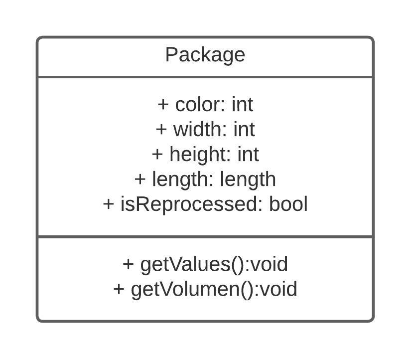

# **Práctica 2**
### Universidad de San Carlos de Guatemala
### Facultad de Ingeniería
### Escuela de Ciencias y Sistemas
### Arquitectura de Computadores y Ensambladores 1
### Sección B
  

## **Manual Técnico**
  

| Nombre | Carnet | 
| --- | --- |
| Daniel Estuardo Cuque Ruíz | 202112145 |
| Damián Ignacio Peña Afre | 202110568 |
| Alvaro Norberto García Meza | 202109567 |
| José Manuel Ibarra Pirir | 202001800 |
----
# **Descripción General**
La práctica del laboratorio de Arduino que se describe implica el uso de dos placas de desarrollo, un Arduino UNO y un Leonardo, para crear una máquina transportadora capaz de detectar el color de la etiqueta y medir sus dimensiones con sensores de luz y ultrasonido respectivamente.

El reto de la práctica es construir un sistema de medición preciso y confiable para la etiqueta de la máquina transportadora. Para lograr esto, se utilizan tres sensores de ultrasonido para medir la longitud, el ancho y la altura de la etiqueta. Además, se utiliza un sensor de luz para detectar el color de la etiqueta.

Una vez que se han medido las dimensiones de la etiqueta, se utiliza la comunicación I2C para enviar los datos desde el Arduino esclavo que se encarga de la medición a la placa principal. Esta comunicación se realiza de manera cableada y se utiliza para transmitir los datos medidos desde el esclavo al Arduino maestro.

Una vez que se han recibido los datos medidos, se almacenan en un array y se muestran en una pantalla LCD para su visualización. Esta pantalla LCD muestra los datos medidos de la etiqueta en tiempo real, lo que permite una evaluación rápida y eficiente del proceso de medición.

En general, esta práctica del laboratorio de Arduino es un buen ejemplo de cómo se pueden utilizar múltiples placas de desarrollo de Arduino para construir un sistema más completo y funcional. La combinación de sensores de luz y ultrasonido para medir las dimensiones de la etiqueta, la comunicación I2C inalámbrica para enviar los datos medidos y la pantalla LCD para visualizar los resultados, demuestra cómo los dispositivos de Arduino pueden ser utilizados para construir sistemas automatizados y precisos en una amplia gama de aplicaciones.

## protocolo I2C Arduino
El protocolo I2C (Inter-Integrated Circuit) es un protocolo de comunicación serial síncrono utilizado para la comunicación entre dispositivos electrónicos. Es comúnmente utilizado en el mundo de Arduino para la comunicación entre diferentes dispositivos de la plataforma.

La implementación de este protocolo fue mediante el uso de dos Arduino, conectados en sus pines SDA y SCL respectivamente. El Arduino maestro se encarga de manejar la pantalla LCD, botones para controlar el uso de la máquina y consultarle al Arduino esclavo por información entrante para ser almacenada en un lista, donde se mostrará en la pantalla. Toda esta comunicación se maneja de manera flexible con la biblioteca “Wire.h” la cual facilita la conexión entre Arduino y establecer comunicaciones. 

## Diagrama de clases
- Package: Esta clase representa un paquete que fue identificado por su color y dimensiones. Recibe 4 parametros de tipo entero y un método que retorna sus valores para ser ingresados en la pantalla LCD.

## Diseño físico
- Banda Transportadora: Para hacer girar la transportadora se utilizó dos motores DC con caja reductora alimentados con una fuente de 5 volteos. El material utilizado para la banda fue Fomi. 

- Sensor de luz: El sensor de luz se encuentra al inicio de la banda transportadora, pegado a un costado de esta envuelto en una caja para encapsular la luz que entra, ya que este sensor debe ser calibrado para identificar colores específicos, en este caso: rojo, amarillo y azul. 

- Sensor de movimiento: Para medir las dimensiones de la caja se utilizó 3 sensores ultrasónicos. Para obtener las medidas de cada caja se posicionó cada sensor en un lugar específico.
- - Altura: Se colocó un sensor a una distancia de 15cm a nivel de la banda transportadora, cuando detecta un objeto (paquete) obtiene la distancia a la que fue detectada, luego se resta con la altura total.

- - Ancho: Se colocó un sensor a una distancia a un centímetro del costado de la banda transportadora, cuando detecta un objeto (paquete) obtiene la distancia a la que fue detectada, luego se resta con el ancho de la banda transportadora y el centímetro.

- - Largo: Para la medición del largo al igual que la anchura, se tomó como medida estática la distancia del sensor al final de la banda transportadora y el sensor que mide la altura, se toma la distancia cuando el sensor de la altura deja de percibir un objeto debajo de él.
